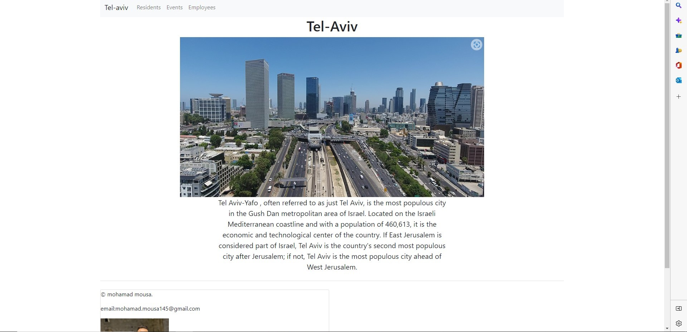

# my-first-app

## <ins>Pages</ins>

### <ins> Home Page</ins>

### <ins>Residents</ins>

#### <ins>Residents details</ins>

#### <ins>Edit Resident</ins>

### <ins>Events </ins>

#### <ins>Events details</ins>

#### <ins>Edit Event </ins>

#### <ins>Employees deatils </ins>

